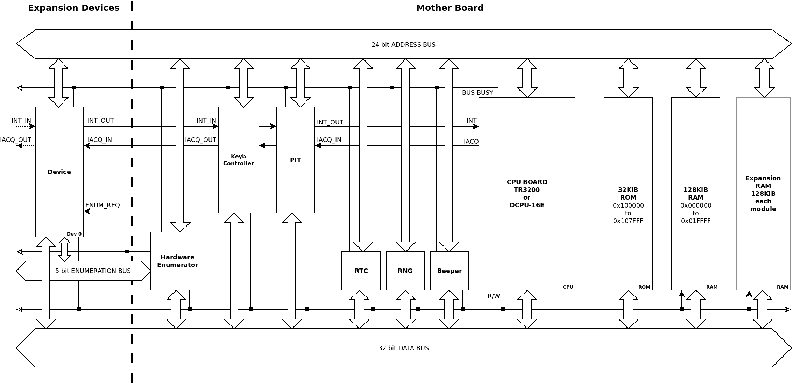

Trillek Virtual Computer Specs
=====================================
Version 0.4c

**ADVICE** : In this documents there some technical stuff that could looks hard
or complex to understand for not hardware guys.
Some of these stuff there is only to give natural limitations of what can do 
and can't do the computer. If your only interest is programing the computer, 
you should check the instruction set of a CPU and the specs of the devices to
understand how program the computer and use the devices at assembly or C 
programing level.

**NOTATION** : Byte is a 8 bit value. Word is a 16 bit value and DWord is a 32 
bit value.

SUMMARY
------

 - 32 bit data bus, but allow transfers of 16 and 8 bit.
 - 24 bit address space (0x000000-0xFFFFFF).
 - Little endian architecture.
 - 32KiB ROM chip at address 0x100000-0x107FFF
 - Initial 128KiB RAM at address 0x000000- 0x01FFFF
 - RAM expandable with modules of 128KiB to a total of 1 MiB of RAM 
   (0x000000-0x0FFFFF)
 - CPUs are connected by a CPU board (actually TR3200 and DCPU-16N) to the 
   mother board. Only one CPU can be connected to the computer at same time 
   (not multi-processor setups)
 - CPU Clock speed could be 1Mhz , 500 Khz, 200 Khz and 100Khz (actually we 
   work with 100Khz, but we expect to allow higher speeds)
 - Devices uses a fixed clock of 100Khz (thinking to change it to 50 KHz) if 
   they need to do periodic or sync stuff.
 - Devices are [memory mapped](http://en.wikipedia.org/wiki/Memory-mapped_I/O).
   So dcpu's **HWI** is replaced by writing/reading to addresses where the 
   device is listening. **HWN** and **HWQ** is replaced by reading addresses.
 - Addresses used by devices are over 0x110000 to avoid address clashes with 
   the RAM/ROM.
 - Address 0x11FF00 contains a read only dword register that returns a unique 
   ID of the motherboard. 
 - Addresses 0x110000 to 0x112000 are reserved to Devices Enumeration and 
   Communication.
 - At address 0x11**XX**00, were **XX** is the device slot number (to a total 
   of 32 -> 0x20), there is mapped an address block that consists : 
   Device Type, Device Builder ID, Device ID, CMD, A, B, C, D, E hardware registers. 
 - Devices could do **DMA** operations at will, but ONLY one device could do 
   that at same time, and can only transfer 4 bytes every Device Clock (like 
   if the DMA operates in the falling clock flank and the CPU operated in the
   rising clock flank.)
 - Usually the devices exposes his own ram and&or uses commands. The only 
   exception is the most basic graphcis device that uses computer RAM as buffer.
 - The computer can be expanded to a total 32 devices, not counting integrated 
   devices on motherboard. This can be archived by plugin the device boards in 
   the expansion bus. Some devices will require a external module attached to 
   the computer, like floppy drives, graphics cards, joysticks, weapons, etc...
 - Integrated devices on motherboard:
     - Programmable Interval Timer (**PIT**) aka *Clock* device.
     - Real Time Clock (**RTC**), that gives the date and time in game world 
       when is polled (not have alarm).
     - Random Number Generator (**RNG**), that generates a 32 bit random number
       every time that is polled (at implementation level, a simple call to 
       rand_r)
     - Beeper or *buzzer* device (**Beeper**). Simply generates a squared wave 
       sound at desired frequency.

HOW WORKS
---------

As can you see, the computer uses a 24 bit Address Bus and 32 bit Data bus. RAM
and ROM are directly attached to these buses, as any device in the computer
that is controllable by software. Also there is the integrated devices.

### Interrupts

To avoid clashes with interrupt petitions, we daisy chain the interrupt signals
*INT* and *IACQ* . So when two devices try to generate a interrupt at same time
, the device more near to the CPU (with lowest slot number), have preference. 
The **PIT** and **Keyboard controller** devices can generate interrupts, so we 
put it between the expandable devices and the CPU having more preference that 
any expansion device. Plus the **PIT** have more preference as is more near to 
the CPU that the Keyboard Controller.

**NOTE FOR USERS**: In other words, you only need to worry about the interrupt 
message in your **Interrupt Service Routine** (ISR). This stuff is to put some 
limitations to the computer and add some details at implementation of it.

**NOTE FOR IMPLEMENTATION**: This means that when you need to "executes" the 
hardware devices, you only need to loop the device array in order and check if 
device **x** send a Interrupt. If it happens, allow it to send the message to 
the CPU, and just ignore the Interrupt petitions for the rest of the loop.

### Hardware Enumeration

Devices maps 0x11**XX**00 address block, were XX is the slot were is plugged. 
In these address block, there is a few registers :

 - Present flag (Read byte): At offset 0,there is a byte that always read 0xFF 
   if a device is plugged in these slot
 - Device Type register (Read byte): At offset 1, there is a byte that gives 
  information about the device type (see Device Type list section)
 - Device Builder ID register (Read dword) : At offset 2, there is dword that 
   gives the Builder ID of the device (see know Device Builder list section)
 - Device ID register (Read byte) : At offset 6, there is a byte that gives the
   Device ID. 
 - Device Revision register (Read byte) : At offset 7, there is a byte that 
   gives the Device Revision. It's expected that higher revision are backwards 
   compatible , adding new features or fixing bugs in previous revisions.
 - CMD register (Write word) : At offset 8, there is a d that writing to it, 
   sends a command to the device. The command list is dependent of the device,
   and is showed in the device specs.
 - A, B, C, D, E registers (Read/Write word every one) : Begin at offset 10, 
   there is five word registers that are used to send values with the commands 
   and receive status/error or other stuff from the devices.
 
To know how many devices are plugged to the computer, you only need to read the 
first byte of the 32 addresses and count one more for every byte being 0xFF.
The tuple {Device Type, Device ID} defines a unique device. This information 
can be used to allow the software know what device is plugged and how should 
use it.

**NOTE FOR USERS**: This is nearly the same stuff that does the original 
Notch's DCPU-16, but being memory mapped instead of being special magic 
instructions. Each device have his own set registers. The device at slot 0 have
this registers at 0x110000, and A register is at 0x11000A; device 8 have his 
registers at 0x110800, and BuildID register is at 0x110802; etc...

#### Device Class values

 - 0x01 : Audio devices (Sound Cards)
 - 0x02 : Communications devices
 - 0x03 : HID (Human Interface Device)
 - 0x04 : Expansion buses
 - 0x06 : Image/Video Input Devices
 - 0x07 : Printer (2D and 3D) Devices
 - 0x08 : Mass Storage Device (Floppy drives, Microdrives, Hard disks, Tape 
   recorders)
 - 0x0A : Co-Processors
 - 0x0E : Graphics Devices (Graphics card)
 - 0x0F : HoloGraphics Devices
 - 0x10 : Ship Sensors (DRADIS, Air, Hull integrity, etc...)
 - 0x11 : Power Management Systems (control of Generators)
 - 0x12 : Hydraulic/Pneumatic Actuators (control of doors, air-locks, landing 
   gears)
 - 0x13 : Electric Engines (control of wheels and steering)
 - 0x1A : Defensive Systems (control of shields)
 - 0x1B : Offensive Systems (control of weapons)
 - 0x1C : Sub-FTL Navigational and Engine Systems (control of thrusters and 
   engines)
 - 0x1D : FTL Navigational Systems (control of warp engines)
 - 0xFF : Multifunction devices.

#### Know Builder values

- 0x00000000 -> Unknown builder (reserved value)
- 0x1C6C8B36 -> Nya Elektriska
- 0x1EB37E91 -> Mackapar Media
- 0x21544948 -> Harold Innovation Technologies (Harold I.T.)
- 0x494E5645 -> Investronics

### PIT (PROGRAMMABLE INTERVAL TIMER)

The PIT consists in two 32 bit timers as can you find in any modern 
micro-controller. Allow to do time measurements and generate periodic 
interrupts for system clock and tasks switchers. Have the highest priority when
needs to signal a interrupt.

**NOTE FOR USERS**: Could look a bit more hard that the Noth's DCPU-16 Timer 
device, but gives more freedom and control. Plus is more easy to 
understand and use that the IBM PC timer. Using the highest interrupt priority 
means that will be the first Interrupt to be attended by the CPU when 
simultaneous interrupts happens.

**NOTE FOR VM IMPLEMENTATION**: Uses two vars per timer. One stores the Reload 
value and the other count downs every timer clock tick. The times generated are
in Virtual Computer time, so if you run the Virtual Computer at 200% speed, the
measured times should be the half.

### RTC (Real Time Clock)

Is a basic device that gives the actual game time and date. Not have alarm, so 
is necessary doing a polling every 12 or 24 hours to keep a software clock in 
sync with game time.

### RNG (Random Number Generator)
Is a basic device that writing to it, sets the RNG seed, and reading from it, 
gets a 32 bit random number.

### Beeper
Simple basic Beeper with similar functionality to the IBM PC speaker or 
ZX Spectrum beeper. It have less power as can't allow do PWM to generate basic
crude PCM sound, but it makes a lot more simple to use and understand.

**NOTE FOR VM IMPLEMENTATION**: Try to use a Band-Limited Sound Synthesis lib 
to generate square wave sound, but a crude Fourier synthesis could do the trick.

### Devices with DMA (Direct Memory Access)
DMA operations by the hardware devices are allowed, but only one DMA operation 
could be happening at same time at a rate of 4 byte for each device clock. To 
avoid that two or more devices try to do a DMA operation, there is a BUSY BUS 
signal. DMA operations happens in the opposite flank that the CPU clock, so 
don't interfere and not need contention hardware.

**NOTE FOR VM IMPLEMENTATION**: By practical reasons, this will translated in a
flag in the Virtual Computer to indicate if a device will being doing DMA, as 
can't be two devices doing a DMA at same time. 

DOCUMENTS
---------

- [TR3200 CPU](./TR3200.md)
- [DCPU-16N CPU](./DCPU-16N.txt)
- [Programmable Interval Timer](./Timers.md) (aka Timer or Clock)
- [Beeper](./Beeper.md)
- [Generic Keyboard](./Keyboard.md)
- [Text Generator Adapter](./TGA.md) (TGA)
- [Color Display Adapter](./CDA.md) (CDA)
- [5.25" Floppy Drive](./floppy_drive.md) (M5FDD)
- [Computer Architecture Diagram](./computer.dia) (DIA file)
- [Calling Conventions](./calling_convention.md)

## ADVICE

The actula reference implementation, in Trillek MS2.5, is not yet updated to 
the latests specs.

