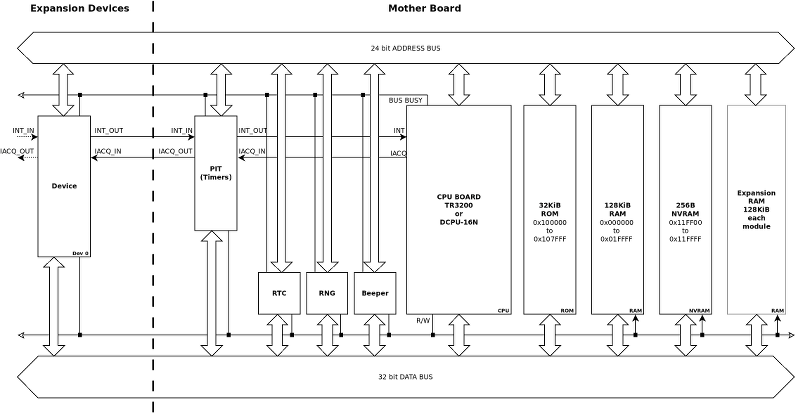
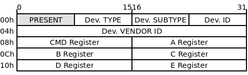

Trillek Virtual Computer Specifications
=====================================
Version 0.4.9

**WARNING: EVERYTHING IN ALL THESE DOCUMENTS IS PRE-1.X AND IS SUBJECT TO CHANGE WITHOUT ANY FORM OF NOTICE.**

**ADVICE** : In this document there is some technical stuff that could look 
complex or hard to understand for non-hardware folks.
Some of these things exist only to give natural limitations of what the computer
can and can't do. If your only interest is programing the computer, 
you should check the instruction set of a CPU and the specs of the devices to
understand how to program the computer and use the devices at assembly or C 
programing level.

**NOTATION** : Byte is a 8 bit value. Word is a 16 bit value and DWord is a 32 
bit value.

SUMMARY
------

 - 32 bit data bus, but allow transfers of 16 and 8 bit.
 - 24 bit address space (0x000000-0xFFFFFF).
 - Little endian architecture.
 - 32KiB ROM chip at address 0x100000-0x107FFF
 - Initial 128KiB RAM at address 0x000000- 0x01FFFF
 - RAM expandable with modules of 128KiB to a total of 1 MiB of RAM 
   (0x000000-0x0FFFFF)
 - CPUs are connected by a CPU board (actually basic TR3200) to the 
   mother board. Only one CPU can be connected to the computer at same time 
   (no multi-processor setups)
 - CPU Clock speed could be 1Mhz , 500 Khz, 200 Khz and 100Khz (actually we 
   work with 100Khz, but we expect to allow higher speeds). CPU clock speed in KHz 
   can be read at address 0x11E050
 - Devices use a fixed clock of 100Khz (thinking to change it to 50 KHz) if 
   they need to do something periodically or sync stuff.
 - Devices are [memory mapped](http://en.wikipedia.org/wiki/Memory-mapped_I/O).
   So dcpu's **HWI** is replaced by writing/reading to addresses where the 
   device is listening. **HWN** and **HWQ** are replaced by reading addresses.
 - Addresses used by devices are over 0x110000 to avoid address clashes with 
   the RAM/ROM.
 - Addresses 0x110000 to 0x112000 are reserved to Devices Enumeration and 
   Communication.
 - At address 0x11XX00, where **XX** is the device slot number (to a total 
   of 32 -> 0x20), there is mapped the **Enumeration And Control registers** of 
   device **XX**, that consists of: 
   Device Type, Device SubType, Device ID, Device Vendor ID, CMD, A, B, C, 
   D, E hardware registers. 
 - Devices could do **DMA** operations at will, but ONLY one device could do 
   that at a time, and can only transfer 4 bytes every Device Clock (i.e. 
   if the DMA operates in the falling clock flank and the CPU operated in the
   rising clock flank.)
 - Usually the devices expose their own ram and&or uses commands. The only 
   exception is the most basic graphics device that uses computer RAM as buffer.
 - The computer can be expanded to a total 32 devices, not counting integrated 
   devices on motherboard. This can be achieved by plugging the device boards in 
   the expansion bus. Some devices will require an external module attached to 
   the computer, like floppy drives, graphics cards, joysticks, weapons, etc...
 - Integrated devices on motherboard:
     - Programmable Interval Timer (**PIT**) aka *Clock* device.
     - Real Time Clock (**RTC**), that gives the date and time in game world 
       when it's polled (does not have alarm).
     - Random Number Generator (**RNG**), that generates a 32 bit random number
       every time that it's polled (at implementation level, a simple call to 
       rand_r)
     - Beeper or *buzzer* device (**Beeper**). Simply generates a squared wave 
       sound at desired frequency.
     - 256 bytes of NVRAM (Not Volatile RAM). Useful to store basic configration 
       used at boot time.
     - 256 bytes reserved for CPU board HW registers from 0x11FF00 to 0x11FFFF

HOW IT WORKS
------------

As can you see, the computer uses a 24 bit Address Bus and 32 bit Data bus. RAM
and ROM are directly attached to these buses, as are any device in the computer
that is controllable by software. Also there are the integrated devices.

### Interrupts

To avoid clashes with interrupt petitions, we daisy chain the interrupt signals
*INT* and *IACQ* . So when two devices try to generate an interrupt at the same
time, the device nearer to the CPU (with lowest slot number), has preference. 
The **PIT** and **Keyboard controller** devices can generate interrupts, so we 
put it between the expandable devices and the CPU having more preference than 
any expansion device. Plus the **PIT** has more preference as it's nearer to 
the CPU than the Keyboard Controller.

**NOTE FOR USERS**: In other words, you only need to worry about the interrupt 
message in your **Interrupt Service Routine** (ISR). This stuff is to put some 
limitations to the computer and add some details at implementation of it.

**NOTE FOR IMPLEMENTATION**: This means that when you need to "execute" the 
hardware devices, you only need to loop the device array in order and check if 
device **x** sends an Interrupt. If it does, allow it to send the message to 
the CPU, and just ignore the Interrupt petitions for the rest of the loop.

### Hardware Enumeration

Devices map 0x11XX00 address block, where XX is the slot in which it is plugged. 
In this address block that we call **Enumeration And Control registers**, there
 are a few registers :

 - Present flag (Read byte): At offset 0,there is a byte that always reads 0xFF 
   if a device is plugged in these slot.
 - Device Type register (Read byte): At offset 1, there is a byte that gives 
   information about the device type (see Device Type list section).
 - Device SubType register (Read byte): At offset 2, there is a byte that gives 
   information about the device subtype (see Device Type list section).
 - Device ID register (Read byte) : At offset 3, there is a byte that gives the
   Device ID. 
 - Device Vendor ID register (Read dword) : At offset 4, there is a dword that 
   gives the Vendor/Builder ID of the device (see Known Device Vendor list section). 
 - CMD register (Write word) : At offset 8, there is a dword that, when writing 
   to it, sends a command to the device. The command list is dependent on the 
   device, and is shown in the device specs.
 - A, B, C, D, E registers (Read/Write, one word each) : Beginning at offset 10, 
   there are five one-word registers that are used to send values with the 
   commands and receive status/error or other stuff from the devices.

 
To know how many devices are plugged in to the computer, you only need to read the 
first byte of each of the 32 addresses and count one for every byte being 0xFF.
The tuple {Device Vendor ID, Device ID} defines a unique device. This information 
can be used to allow the software to know what device is plugged in and how to 
use it. Note that devices could be on any slot and that  ould be empty slots between slots with devices plugged.
Devices that have the same {Device Type ID, Device SubType ID} are expected to 
share some minimal compatibility. To achieve this, they yshould share a minimal list 
of commands with the same expected behavior.

**NOTE FOR USERS**: Each device has its own set of registers. The device at slot 0 has
these registers at 0x110000, and its A register is at 0x11000A; device 8 has these 
registers at 0x110800, and its BuildID register is at 0x110804; etc...

#### Device Types and SubTypes values

Here is a list of Device Types. Each entry could contain a sublist of actually know subtypes.

 - 0x00 : Unclassified device
 - 0x01 : Audio devices (Sound Cards)
 - 0x02 : Communications device
     - 0x00 : Parallel data port
     - 0x01 : Serial data port
     - 0x02 : Asynchronous serial port
     - 0x03 : Synchronous serial port
     - 0x10 : Multiplexed parallel data port
     - 0x11 : Multiplexed serial data port
     - 0xFF : Serial Console
 - 0x03 : HID (Human Interface Device)  
     - 0x01 : Western/Latin Keyboard
 - 0x04 : Expansion bus device
     - 0x00 : Bus bridge (remappable standard enumeration)
 - 0x06 : Image/Video Input device
 - 0x07 : Printer (2D and 3D) device
 - 0x08 : Mass Storage device (Floppy drives, Microdrives, Hard disks, Tape 
   recorders)
     - 0x00 : Tape drive / linear storage drive
     - 0x01 : Floppy drive
     - 0x02 : Hard drive
     - 0x03 : Optical media drive
 - 0x09 : Network device
     - 0x01 : generic network bus
     - 0x0E : Ethernet Network device
     - 0x0F : Short-range Wireless Network device
     - 0x11 : Controller Area Network device
 - 0x0A : Co-Processors
 - 0x0E : Graphics Devices (Graphics card)
     - 0x01 : TGA compatible
 - 0x0F : HoloGraphics Devices
 - 0x10 : Ship Sensors (DRADIS, Air, Hull integrity, etc...)
     - 0x00 : Binary input array (buttons / switches)
     - 0x01 : Analog input array (Joysticks / levers)
     - 0x02 : Power meter array
 - 0x11 : Power Management Systems (control of Generators)
     - 0x00 : Switch box (multiple on/off style switches)
     - 0x01 : generic generator (set off/start/run, get output)
     - 0x02 : generic linear generator (set off/start/run/rate, get rate/fuel/output)
 - 0x12 : Hydraulic/Pneumatic Actuators (control of doors, air-locks, landing 
   gears)
     - 0x00 : generic door controller (open/close, get count/state)
     - 0x01 : generic sensor/door controller (open/close, sensor on/off, get count/state/triggered)
 - 0x13 : Electric Engines (control of wheels and steering)
     - 0x06 : Gyro reaction wheel
 - 0x1A : Defensive Systems (control of shields)
 - 0x1B : Offensive Systems (control of weapons)
 - 0x1C : Sub-FTL Navigational and Engine Systems (control of thrusters and 
   engines)
     - 0x00 : Generic engine cluster (set rate/gimbal, get rate/status/fuel)
     - 0x01 : Reaction control system (impulse, set rate, get rate/count/status/axis/fuel)
 - 0x1D : FTL Navigational Systems (control of warp engines)
 - 0xFF : Unassigned class

#### Known Vendor values

- 0x00000000 -> Unknown builder (reserved value)
- 0x048BAD15 -> RocoCorp.
- 0x21544948 -> Harold Innovation Technologies (Harold I.T.)
- 0x494E5645 -> Investronics
- 0xA87C900E -> KaiComm

### PIT (PROGRAMMABLE INTERVAL TIMER)

The PIT consists of two 32 bit timers as you can find in any modern 
micro-controller. They allow one to do time measurements and generate periodic 
interrupts for system clock and task switchers. Has the highest priority when
needs to signal a interrupt.

**NOTE FOR USERS**: It's easier to understand and use than the IBM PC timer. 
Using the highest interrupt priority means that it will be the first Interrupt to be attended by the CPU when simultaneous interrupts happen.

**NOTE FOR VM IMPLEMENTATION**: Uses two vars per timer. One stores the Reload 
value and the other counts down every timer clock tick. The times generated are
in Virtual Computer time, so if you run the Virtual Computer at 200% speed, the
measured times should be the half.

### RTC (Real Time Clock)

Is a basic device that gives the actual game time and date. Doesn't have alarm, so 
it's necessary to poll every 12 or 24 hours to keep a software clock in 
sync with game time. Gives time information in dd-mm-yyyy hh:mm:ss format (see specs)

### RNG (Random Number Generator)
Is a basic device that writing to it, sets the RNG seed, and reading from it, 
gets a 32 bit random number. Simply reading a dword from 0x11E040 gets a 32 bit 
random number. Writing to the same address, sets up the random seed. (see specs)

### Beeper
Simple basic Beeper with similar functionality to the IBM PC speaker or 
ZX Spectrum beeper. It has less power as can't allow do PWM to generate basic
crude PCM sound, but it makes it a lot simpler to use and understand.

**NOTE FOR VM IMPLEMENTATION**: Try to use a Band-Limited Sound Synthesis lib 
to generate square wave sound, but a crude Fourier synthesis could do the trick.

### NVRAM
The computer motherboard includes a small 256 bytes NVRAM powered by a lithium battery.
This small non-volatile RAM is mapped in 0x11F000 to 0x11F0FF, and can be used 
for boot configuration stuff.

### Devices with DMA (Direct Memory Access)
DMA operations by the hardware devices are allowed, but only one DMA operation 
could happen at a time at a rate of 4 byte for each device clock. To 
avoid two or more devices trying to do a DMA operation, there is a BUSY BUS 
signal. DMA operations happen in the opposite flank from the CPU clock, so 
don't interfere and don't need contention hardware.

**NOTE FOR VM IMPLEMENTATION**: For practical reasons, this will translated in a
flag in the Virtual Computer to indicate if a device will being doing DMA, as 
two devices can't do a DMA at the same time. 

ADVICE
------

Trillek MS2.5, is not using the latests specs. Please use the latest version 
from trillek-vcomputer-module.

