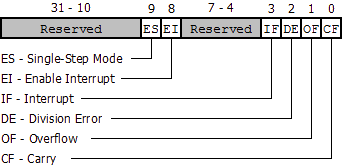
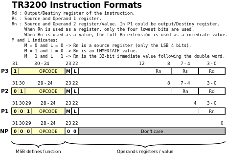

TR3200 (Trillek Risc cpu 32 00) Specification
====================================
Version 0.4.2 


SUMMARY
=======

 * 32 bit RISC CPU
 * 11 general purpose registers (%r0 to %r10)
 * Multiplication/Quotient register (%y)
 * Base Pointer (%bp) and Stack Pointer (%sp) 
 * Flags/Enable bits Register (%flags)
 * Interrupt Address (%ia)
 * Little Endian

In this document, anything within [brackets] is shorthand for 
"the value of the RAM at the location of the value inside the brackets". 
For example, %sp register is "stack pointer", but [%sp] means the value of the RAM 
at the location the stack pointer is pointing. Also in the notation we will use
BYTES for 8 bit values, WORDS for 16 bit values and DWORDs for 32 bit values. 

The TR3200 instruction set is based in 32 bit dwords, so each time that the PC 
is incremented, it is incremented by four or by eight if the instruction is followed by an immediate.
Also is Little Endian, so the MSB of a word or dword is stored in the lowest address, and the LSB
is stored in the highest address.

Whenever the CPU needs to read a instruction, it reads [PC], then increases PC
by four or eight as an instruction uses dword. Shorthand for this is [PC+4]. In some 
cases, the CPU will modify a value before reading it, in this case the 
shorthand is [++X]. When we say that the TR3200 Push a value to the Stack, 
writes these value at [--%sp]. When we say that TR3200 Pops a value from the 
stack, reads a value from [%sp++]. Remember that we work with 32 bit values in
Little Endian, so to store a value in the stack, we need to push each byte of 
the dword value. In other words, pushing to the stack, first decreases %sp, and then writes were 
%sp is pointing.

Also the internal architecture is a not pipelined 3 stages (FETCH, DECODE,
EXECUTE), So the majority of instructions need only 3 cycles 
to be fully executed. there are exceptions like multiplication, ram/stack instructions, etc that uses the EXECUTE stage multiples times and will need extra cycles to be fully executed.

Advice, code must be aligned to 4 byte boundary, as PC register value always is a multiply of 4.


Registers :
 
  - %r0 .. %r10 - General Purpose Registers (GPR)
  - %r11 - %y - Multiplication/Rest register
  - %r12 - %bp - Base Pointer  -> Use as pointer to the local frame in the stack  
  - %r13 - %sp - Stack Pointer -> Points to the last value Pushed in the stack
  - %r14 - %ia - Interrupt Address
  - %r15 - %flags - Flags/Enable bits register
  - PC - Program Counter  

FLAGS register :

  - BIT 31-10-> Reserved
  - BIT 9    -> ENABLE SINGLE-STEP MODE (ESS)
  - BIT 8    -> ENABLE INTERRUPT (EI)
  - BIT 4-7  -> Reserved
  - BIT 3    -> INTERRUPT FLAG: 1 If an interrupt is happening. (IF)
  - BIT 2    -> DIVISION ERROR FLAG: 1 If was a division error. (DE)
  - BIT 1    -> OVERFLOW FLAG: 1 If an arithmetic operation overflowed. (OF)
  - BIT 0    -> CARRY FLAG: 1 If the last ADDx/SUBx carried or borrowed a bit. (CF)

If ESS bit is enable, the TR3200 will generate an appropriated interrupt with message 0.

[](../img/dia/FLAGS_format.png)

The Overflow flag gets his value, comparing the sign of the operands and the sing of the result, follow this truth table : 

```
       ADDITION SIGN BITS           SUBTRACTION SIGN BITS              
    num1sign num2sign sumsign    num1sign num2sign sumsign                
    ---------------------------  ---------------------------
     0       0        1           0        1        1
     1       1        0           1        0        0
```
For example, for addition : OF = SIGN_BIT(num1) == DW_SIGN_BIT(num2) && DW_SIGN_BIT(num1) != DW_SIGN_BIT(result)

BOOT/RESET STATUS
-----------------

All registers are set to 0 when the TR3200 boot-up or does a reset.


INSTRUCTIONS FORMAT
-------------------

There is four instruction formats, that could be differentiate by the two MSB
bits.

- Form P3 : Three parameter instruction format
- Form P2 : Two parameter instruction format
- Form P1 : One parameter instruction format
- Form NP : No parameter instruction format

[](../img/dia/TR3200_ins_format.png)

### M and L bits

M and L indicates:
- if M = 0 and L = 0, Rn is a source register (only the LSB 4 bits)
- if M = 1 and L = 0, Rn is an IMMEDIATE value
- if M = 1 and L = 1, Rn is the 32-bit immediate value following the instruction. Takes a extra cycle
- the case where M = 0 and L = 1 is reserved.

### P3 - Instructions with 3 parameters
This format is usual for ALU  that does "a = b op c" and Load/Store instructions
that does indexed access.

    31 30 29 28 27 26 25 24 23 22 21 20 19 18 17 16 15 14 13 12 11 10 09 08 07 06 05 04 03 02 01 00
    -----------------------------------------------------------------------------------------------
    1  o  o  o  o  o  o  o  M  L  rd rd rd rd rs rs rs rs rn rn rn rn rn rn rn rn rn rn rn rn rn rn

Where :

- ooooooo is the instruction OpCode
- Rn is a source register (only the LSB 4 bits) or an IMMEDIATE value. See signification of M and L bits.
- Rs is a source register
- Rd is the target register

If the M bit is 1 and L = 0, Rn acts like a immediate value in complement two, from 8191 to -8192. 

If M = 1 and L = 1 the next dword is used as 32 bit immediate value.


    Mnemonic   OpCode  Description             P-Code                  Cycle Count
    -------------------------------------------------------------------------------
    AND        0x80    Bitwise And             Rd = Rs AND Rn                    3
    OR         0x81    Bitwise Or              Rd = Rs OR Rn                     3
    XOR        0x82    Bitwise XOr             Rd = Rs XOR Rn                    3
    BITC       0x83    Bitclear                Rd = Rs AND NOT Rn                3

    ADD        0x84    Addition                Rd = Rs + Rn                      3
    ADDC       0x85    Addition with Carry     Rd = Rs + Rn + C                  3
    SUB        0x86    Substraction            Rd = Rs - Rn                      3
    SUBB       0x87    Subs with Burrow        Rd = Rs - (Rn + C)                3
    RSB        0x88    Reverse Substract       Rd = Rn - Rs                      3
    RSBB       0x89    RSB with Burrow         Rd = Rn - (Rs + C)                3

    LLS        0x8A    Logical Left Shift      Rd = Rs << Rn                     3
    LRS        0x8B    Logical Right Shift     Rd = Rs >> Rn                     3
    ARS        0x8C    Arithmetic Right Shift  Rd = Rs >>> Rn                    3
    ROTL       0x8D    Rotate Left             Rd = Rs ROTL Rn                   3
    ROTR       0x8E    Rotate Right            Rd = Rs ROTR Rn                   3

    MUL        0x8F    Multiplication 32x32    Y:Rd = Rs * Rn                   20
    SMUL       0x90    Signed Multiplication   Y:Rd = Rs * Rn                   30
    DIV        0x91    Division 32:32          Rd = Rs / Rn ; Y = Rs % Rn       25
    SDIV       0x92    Signed Division         Rd = Rs / Rn; Y = Rs % Rn        35


    LOAD       0x93    Loads a dword           Rd = ram[Rs + Rn]                 3
    LOADW      0x94    Loads a word            Rd = ram[Rs + Rn]                 3
    LOADB      0x95    Loads a byte            Rd = ram[Rs + Rn]                 3

    STORE      0x96    Saves a dword           ram[Rs + Rn] = Rd                 3
    STOREW     0x97    Saves a word            ram[Rs + Rn] = Rd                 3
    STOREB     0x98    Saves a byte            ram[Rs + Rn] = Rd                 3


#### Notation and Examples
Syntax : 

    - *instr* Rd, Rs, Rn
    - store Rs, Rn, Rd
    - load Rd, Rs, Rn

Examples :

    - %r7 = %r6 | %r7 : or %r7, %r6, %r7   ->  0x81000767
    - Loads dword at %r1+1024 in %r7 : laod %r7, %r1, 1024 -> 0x60A80227
    - %r0 = %r1 & 0xAAAA5555 : and %r0, %r1, 0xAAAA -> 0xC0C00010, 0xAAAA5555

### P2 - Instructions with 2 parameters
This format is usual for ALU  that does "a = op b", Load/Store, Jump/Call and skip instructions

```
    31 30 29 28 27 26 25 24 23 22 21 20 19 18 17 16 15 14 13 12 11 10 09 08 07 06 05 04 03 02 01 00
    -----------------------------------------------------------------------------------------------
    0  1  o  o  o  o  o  o  M  L  rd rd rd rd rn rn rn rn rn rn rn rn rn rn rn rn rn rn rn rn rn rn
```
Where :

- oooooo is the instruction Op Code
- Rn is a source register (only the LSB 4 bits) or an IMMEDIATE value. See signification of M and L bits.
- Rd is the target or source register 

If the M bit is 1 and L = 0, Rn acts like a immediate value in complement two, from 131071 to -131072.

If M = 1 and L = 1 the next dword is used as 32 bit immediate value.
    
```
    Mnemonic   OpCode  Description             P-Code                  Cycle Count
    -------------------------------------------------------------------------------
    MOV        0x40    Set/Move a value        Rd = Rn                          3
    SWP        0x41    Swaps values            Rd = Rn; Rn = Rd (M bit = 0)     3
    NOT        0x42    Does bitwise NOT        Rd = NOT Rn                      3

    SIGXB      0x43    Extend Sign of Byte     Rd = Rn | 0xFFFFFF00 if Rn[7]    3
    SIGXW      0x44    Extend Sign of Word     Rd = Rn | 0xFFFF0000 if Rn[15]   3
    

    LOAD       0x45    Loads a dword           Rd = ram[Rn]                     3
    LOADW      0x46    Loads a word            Rd = ram[Rn]                     3
    LOADB      0x47    Loads a byte            Rd = ram[Rn]                     3

    STORE      0x48    Saves a dword           ram[Rn] = Rd                     3
    STOREW     0x49    Saves a word            ram[Rn] = Rd                     3
    STOREB     0x4A    Saves a byte            ram[Rn] = Rd                     3

    (Absolute JUMPs/CALLs)
    JMP        0x4B    Absolute Jump
                             if M=1 & L=0       %pc = (Rd + (Imm << 2))         3
                             if M=0 | M=L=1     %pc = (Rd + Rn) & 0xFFFFFFFC    3
    CALL       0x4C    Absolute Jump& Push %pc
                             if M=1 & L=0       %pc = (Rd + (Imm << 2))         4
                             if M=0 | M=L=1     %pc = (Rd + Rn) & 0xFFFFFFFC    4

    (Branch instructions 0x70 to 0x7F)
    IFEQ       0x70    Execute If Rd == Rn                                     +3 
    IFNEQ      0x71    Execute If Rd != Rn                                     +3   
    IFL        0x72    Execute If Rd < Rn (unsigned)                           +3
    IFSL       0x73    Execute If Rd < Rn (signed)                             +3
    IFLE       0x74    Execute If Rd <= Rn (unsigned)                          +3
    IFSLE      0x75    Execute If Rd <= Rn (signed)                            +3

    IFG        0x76    Execute If Rd > Rn (unsigned)                           +3
    IFSG       0x77    Execute If Rd > Rn (signed)                             +3
    IFGE       0x78    Execute If Rd >= Rn (unsigned)                          +3
    IFSGE      0x79    Execute If Rd >= Rn (signed)                            +3

    IFBITS     0x7A    Execute If Rd & Rn != 0                                 +3
    IFCLEAR    0x7B    Execute If Rd & Rn == 0                                 +3
```

#### Notation and Examples
Syntax : 

    - *instr* Rd, Rn
    - load Rd, Rn
    - store Rn, Rd
    - jmp/call Rd, Rn

Examples :

    - Set %r10 = %sp : mov %r10, %sp -> 0x400000DA
    - Jumps to %r1 + 0x300 : jmp %r1, 0x300 -> 0x59800C01
    - Writes LSB byte in %r10 to 0xFF0B0000 : storeb 0xFF0B0000, %r10 -> 0x48C0000A, 0xFF0B0000

### P1 - Instructions with 1 parameters
This format is usual for Registers manipulation, Stack operations and Jump/Call instructions
```
    31 30 29 28 27 26 25 24 23 22 21 20 19 18 17 16 15 14 13 12 11 10 09 08 07 06 05 04 03 02 01 00
    -----------------------------------------------------------------------------------------------
    0  0  1  o  o  o  o  o  M  L  rn rn rn rn rn rn rn rn rn rn rn rn rn rn rn rn rn rn rn rn rn rn
```

Where :

- ooooo is the instruction Op Code
- Rn is a source register (only the LSB 4 bits) or an IMMEDIATE value. See signification of M and L bits.

If the M bit is 1 and L = 0, Rn acts like a immediate value in complement two, from 2097151 to -2097152.

If M = 1 and L = 1 the next dword is used as 32 bit immediate value.

```
    Mnemonic   OpCode   Description             P-Code                  Cycle Count
    -------------------------------------------------------------------------------
    XCHGB      0x20     Exchange Bytes of the 16 LSB  (M = 0)                    3
    XCHGW      0x21     Exchange Words  (M = 0)                                  3
    
    GETPC      0x22     Return %pc value        Rn = %pc+4 (M = 0)               3
  

    POP        0x23     Pops from the stack     %sp +=4 ; Rn = [%sp] (M = 0)     3
    PUSH       0x24     Push to the stack       [%sp] = Rn ; %sp -=4 (M = 0)     3


    (Absolute JUMPs/CALLs)
    JMP        0x25    Absolute Jump
                              if M=1 & L=0      %pc = Imm << 2                   3
                              if M=0 | M=L=1    %pc = Rn & 0xFFFFFFFC            3
    CALL       0x26    Absolute Jump& Push %pc
                              if M=1 & L=0      %pc = Imm << 2                   4
                              if M=0 | M=L=1    %pc = Rn & 0xFFFFFFFC            4
    
    (Relative JUMPs/CALLs)
    RJMP       0x27    Relative Jump
                              if M=1 & L=0      %pc = %pc + (Imm << 2)           3
                              if M=0 | M=L=1    %pc = (%pc + Rn) & 0xFFFFFFFC    3
    RCALL      0x28    Relative Jump& Push %pc
                              if M=1 & L=0      %pc = %pc + (Imm << 2)           4
                              if M=0 | M=L=1    %pc = (%pc + Rn) & 0xFFFFFFFC    4
   

    INT        0x29    Software Interrupt                                        6
```

#### Notation and Examples
Syntax : 

    - *instr* Rn

Examples :

    - int 21h -> 0x29800021
    - call 0xBEBECAFE -> 0x26C00000, 0xBEBECAFE

### NP - Instructions without parameters
This format is for special instructions that allows to return from a Call or Interrupt or Sleep the CPU.

```
    31 30 29 28 27 26 25 24 23 22 21 20 19 18 17 16 15 14 13 12 11 10 09 08 07 06 05 04 03 02 01 00
    -----------------------------------------------------------------------------------------------
     0  0  0  o  o  o  o  o  0  0  x  x  x  x  x  x  x  x  x  x  x  x  x  x  x  x  x  x  x  x  x  x
```
Where :

- ooooo is the instruction Op Code
- x are reserved bits for future expansions. Must be 0.

```
    Mnemonic   OpCode  Description             P-Code                  Cycle Count
    -------------------------------------------------------------------------------
    SLEEP      0x00         Sleeps the CPU and waits that a Interrupt happens   +1
    RET        0x01         Return from subrutine                                4
    RFI        0x02         Return from interrupt                                6
```

#### Notation and Examples
Syntax : 

    - *instr*

Examples :

    - ret -> 0x01000000 

DESCRIPTION OF INSTRUCTIONS
===========================
  
RAM INSTRUCTIONS
----------------
  
    LOAD    Rd, Rs, Rn
    LOAD    Rd, Rn
    
    LOADW   Rd, Rs, Rn
    LOADW   Rd, Rn
    
    LOADB   Rd, Rs, Rn
    LOADB   Rd, Rn
  
Load a dword value from RAM at (Rs + Rn) address or Rn address

**LOADW** reads a word value, and **LOADB** loads a byte value. In this cases, the read value is put in the LSB of REG3 register.
  
  
    STORE   Rs, Rn, Rd
    STORE   Rn, Rd
    
    STOREW  Rs, Rn, Rd
    STOREW  Rn, Rd
    
    STOREB  Rs, Rn, Rd
    STOREB  Rn, Rd
  
Write Rd value in RAM at address Rs + Rn or at address Rn.

**STOREW** writes a word value, and **STOREB** writes a byte value. The value is get from the LSB of Rd.


REGISTER MANIPULATION
---------------------

    MOV Rd, Rn  

    Sets Rd to Rn.


    SWP Rd, Rn  

    Swaps Rd and Rn values.


    SIGXB Rd, Rn  

    Extends the sing of LSB byte of Rn and puts in Rn.


    SIGXW Rd, Rn  

    Extends the sing of LSB word of Rn and puts in Rn.


    XCHGW Rn  

    Swaps the MSB and LSB words of Rn.

    
    XCHGB Rn  

    Swaps the MSB and LSB bytes of the LSB word of Rn.

Note : XCHGB and XCHW allows to swap endianes using 3 instructions.


    GETPC Rn  

    Sets Rn to %pc + 4.

  
ALU INSTRUCTIONS
----------------
  
    NOT Rd, Rn
  
Does the bitwise NOT operation between Rs and Rn and put it in Rd.
 

    AND Rd, Rs, Rn
  
Does the bitwise AND operation between Rs and Rn and put it in Rd.

Rd = Rs and Rn
  
  
    OR Rd, Rs, Rn
  
Does the bitwise OR operation between Rs and Rn and put it in Rd.

Rd = Rs or Rn
  
  
    XOR Rd, Rs, Rn
  
Do the logic XOR operation between Rs and Rn and put it in Rd.

Rd = Rs xor Rn
  
  
    BITC Rd, Rs, Rn
  
Do the logic AND operation between Rs and (NOT Rn) and put it in Rd.

Rd = Rs and (not Rn)
 

    LLS Rd, Rs, Rn
  
Do the Logic Left Shift of Rs, displacing the value in Rn bits and put it in Rd. 
The output bit is stored in Carry Flag.

Rd = Rs << Rn

  
    LRS Rd, Rs, Rn
  
Do the Logic Right Shift of Rs, displacing the value in Rn bits and put it in Rd. 
The output bit is stored in Carry Flag.

Rd = Rs >> Rn

  
    ARS Rd, Rs, Rn
  
Do the Arithmetic Right Shift of Rs, displacing the value in Rn bits and put it in Rd. 
The output bit is stored in Carry Flag.

Rd = Rs >>> Rn

  
    ROTL Rd, Rs, Rn
  
Do the Left Rotation of Rs, rotating the value in Rn bits and put it to Rd. 

  
    ROTR Rd, Rs, Rn
  
Do the Right Rotation of Rs, rotating the value in Rn bits and put it to Rd. 
  

    ADD Rd, Rs, Rn
  
Do the addition of Rs + Rn and put it on Rn. Sets Carry and Overflow bits.

Rd = Rs + Rn
  

    ADDC Rd, Rs, Rn
  
Do the addition of Rs + Rn + C (Carry Bit) and put it on Rd.

Rd = Rs + Rn + CF


    SUB Rd, Rs, Rn
  
Do the subtraction of Rs - Rn and put it on Rd.

Rd = Rs - Rn


    SUBB Rd, Rs, Rn

Do the subtraction of Rs - (Rn + CF) (Carry Bit) and put it on Rd. 

Rd = Rs - (Rn + CF) = (Rs - Rn) - CF 


    RSB Rd, Rs, Rn
  
Do the subtraction of Rn - Rs and put it on Rd.

Rd = Rn - Rs


    RSBB Rs, Rn, Rd

Do the subtraction of Rn - (Rs + CF) (Carry Bit) and put it on Rd. 

Rd = Rn - (Rs + CF) = (Rn - Rs) - CF
  

    MUL  Rd, Rs, Rn
    SMUL Rd, Rs, Rn

Do the 32x32=64 bit unsigned multiplication of Rs * Rn. Stores the 32 bit MSB in the Y register. 
The LSB 32 bits are stored in Rd. SMUL does the signed operation.

Y:Rd = Rs * Rn


    DIV  Rd, Rs, Rn
    SDIV Rd, Rs, Rn

Does the unsigned integer 32/32 bit division of Rs / Rn and stores the quotient in Rd. 
The rest is stored in Y register. SDIV does the signed operation.
If a division error happens the Division Error flag  will be set to 1.

Rd = Rs / Rn

Y = Rs % Rn


SKIP OPERATIONS
--------------------

  The skip instructions, realizes a comparison between two values. If the test
  fails, the next instruction is skiped. The conditional opcodes take one cycle
  longer to perform if the test fails.

  When they skip a conditional instruction, they will skip an additional
  instruction at the cost of one extra cycle. If the skiped instruction have a 
  long literal, the costs keeps being a single cyle, becase the CPU can check 
  M and L bits without penaly. This continues until a non-conditional 
  instruction has been skipped. This lets you easily chain conditionals. 
  Interrupts are not triggered while the TR3200 is skipping.
  
  
    IFEQ Rd, Rn      Executes next if Rd == Rn
    IFNEQ Rd, Rn     Executes next if Rd <> Rn

    IFL Rd, Rn       Executes next if Rd <  Rn (unsigned ints)
    IFLE Rd, Rn      Executes next if Rd <= Rn (unsigned ints)
    IFSL Rd, Rn      Executes next if Rd <  Rn (signed ints)
    IFSLE Rd, Rn     Executes next if Rd <= Rn (signed ints)
    
    IFG Rd, Rn       Executes next if Rd >  Rn (unsigned ints)
    IFGE Rd, Rn      Executes next if Rd >= Rn (unsigned ints)
    IFSG Rd, Rn      Executes next if Rd >  Rn (signed ints)
    IFSGE Rd, Rn     Executes next if Rd >= Rn (signed ints)
    
    IFBITS Rd, Rn    Execute next if (Rd &  Rn) != 0 (bitwise AND operation)
    IFCLEAR Rd, Rn   Execute next if (Rd &  Rn) == 0 (bitwise AND operation)


JUMP/CALL INSTRUCTIONS
----------------------
JUMP and CALL instructions ignores the two LSB bits of the resulting new %pc 
values to enforce code alignment to 4 byte boundary. So is impossible set %pc at 
address that not is multiple of 4, and avoiding penalty for fetching code from
these addresses.

Absolute Jump Instructions:

    JMP Rd, Rn          Jumps to Rd + Rn.    (Absolute)
    JMP Rn              Jumps to Rn.   (Relative)

    if Rn is an embedded immediate (bits M=1 and L=0), it is multiplied by four to compute the jump
    
Relative Jump Instructions:

    RJMP Rd             Jumps to %pc + Rn.   (Relative)
    
    if Rn is an embedded immediate (bits M=1 and L=0), it is multiplied by four to compute the jump
    
Absolute Call Instructions:

    CALL Rd, Rn         Jumps to Rd + Rn, and Push PC to the stack.
    CALL Rn             Jumps to Rn and Push PC to the stack.

    if Rn is an embedded immediate (bits M=1 and L=0), it is multiplied by four to compute the jump

Relative Call Instructions:

    RCALL Rn            Jumps to %pc + Rn, and Push PC to the stack.
    
    if Rn is an embedded immediate (bits M=1 and L=0), it is multiplied by four to compute the jump
    
Return from Call:

    RET                 Pops %pc from the stack and set %pc to these value.


STACK INSTRUCTIONS
------------------

    PUSH Rn       

Writes a dword value to the stack. As the TR3200 is little endian, It push each byte 
of dword value to the stack, so the %sp register decrements by 4.
  
    POP Rn
  
Reads from the stack a dword value and stores it in the Rn. As the TR3200 is little endian,
It pops each byte of dword value from the stack, so the %sp register by 4.

Note that all stack operations writes/reads **ALWAYS** a dword.


SPECIAL INSTRUCTIONS
--------------------

    NOP                  Same that MOV %r0, %r0. Does nothing
    SLEEP                Sleeps the CPU and wakes when an hardware interrupt is triggered
    
 
INTERRUPT INSTRUCTIONS
----------------------

    INT Rn               Triggers a software interrupt with message Rn.

    RFI                  Return from interrupt. Pops PC and pops %r0. 
                         Also cleans INTERRUPT FLAG and IACK signal.

  

INTERRUPTS
==========    

The interrupts on TR3200 cpu are divided on :

 - Software interrupt : This is an interrupt signalled by software running on a CPU to do system calls, run firmware public functions, etc. In other words, an INT xx instruction
 - Hardware Interrupt : This type of interrupt is generated externally by an device. For example, an flopy drive telling that finished to read an sector from a floppy.
 - Exception : These are generated internally by the CPU and used to alert the running kernel of an event or situation which requires its attention
   - Fault : These can be corrected and the program may continue as if nothing happened.
   - Abort : Some severe unrecoverable error.
   - Trap : Traps are reported immediately after the execution of the trapping instruction.
 
The TR3200 actually supports Software & Hardware interrupts, plus a single Trap (Single Step Mode). 

The TR3200 uses a hybrid of interrupt vector table and interrupt polling as interrupt handle scheme.
The **%ia** register points to a table of 256 pointers were are store the addresses of ISR. To select the entry used, the TR3200 gets the LSB of the interrupt message as table index, and the TR3200 jumps to the address that is stored in that entry. %r0 stores the full interrupt message, giving more information about who and why interrupt as been generated. The Vector table pointed by %ia have a size of 1024 bytes as uses a dword per each entry.

When the **EI** bit on FLAGS register is enable, then the interrupts are enabled. 
Interrupts can be generated by software by INT instruction or by hardware 
getting to Low the INT line. An interrupt is processed when the TR3200  
is ready to process a new instruction (instructions are atomic). When an 
interrupt is being processed, the IACQ line goes to high indicating that the 
TR3200 will ignore the INT line or any software interrupt. This means that all 
interrupts are execute as critical code.

When a Interrupt happens, the TR3200 puts IACK signal to High, gets the address from the table pointed by **%ia**, push to the  stack the values of %r0 and PC registers, sets %r0 and PC, and sets the 
INTERRUPT FLAG to 1. If it's a software interrupt, the message is put on %r0 to 
be processed. If it's a hardware interrupt, sets %r0 to value read in the data 
bus. (%r0 contains always the message from software or hardware interrupt)

When the interrupt service routine ends executing a RFI, the TR3200 pops PC and
%r0 registers, sets IACK (Interrupt Acknowledge) signal to Low, and the 
INTERRUPT FLAG is set to 0.

When a software interrupt is launched but **EI** is disable or the TR3200 is 
processing a interrupt, the INT instruction will take 6 cycles to execute, but 
will act as a NOP.

When the address in the entry of the vector table is 0, then the TR3200 will abort the interrupt like if **EI** is disable.

INTERRUPT LIST
--------------

The interrupt messages should be defined by hardware devices specs. But there a
few interrupts (called Traps) that could be launched by the TR3200 itself, when meets some
special conditions. Actually TR3200 only implements a trap:

- If single-step mode is active (**ESS** bit is enable) and INTERRUPT FLAG is not 
enable, the TR3200 will throw an interrupt with message 0, after executes any 
instruction.

INTERRUPT PRIORITY
------------------

Interrupts have this priority (on descending order) :

1. Software interrupts (INT xx)
2. Hardware interrupts (by a Device)
3. Traps (Single Step Mode)


HARDWARE
========  

The TR3200 handles hardware devices as memory mapped. The usual addresses uses by
the devices begins at 0xFF000000, that is the last 16 megabyte of the address space. 


PROTOCOLS
=========

### Sending an interrupt

1.   Pull down _INT line only if IACQ is low
2.   Wait to IACQ gets High
3.   When IACQ gets High, put in the data bus the interrupt message.
4.   Release _INT line
5.   Wait to IACQ gets Low -> End Of Interrupt (EOI)

